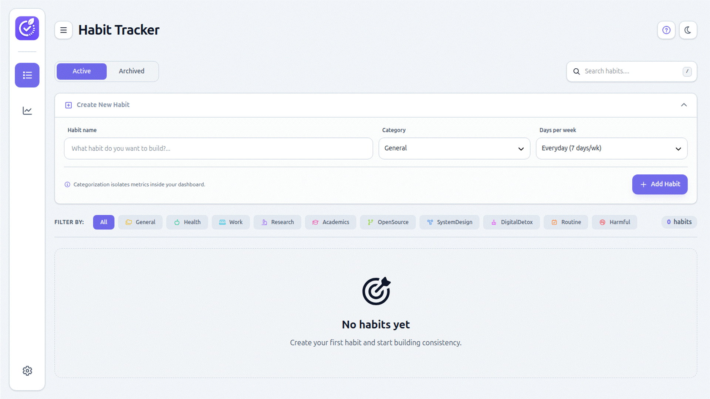

<div align="center">
  
</div>

<br/>
<br>

<div align="center">
  
</div>

<br/>
<br>

<p align="center">
  
  
  
  
  
</p>

<br/>

# Habit Tracker

A modern, lightweight habit-tracking web application designed to help users establish consistent routines and monitor progress through a clean and responsive interface.

## Overview

Habit Tracker is a frontend-focused productivity application that allows users to manage recurring habits, review their progress, and maintain personal consistency without relying on any backend service. All data is stored locally in the browser using `LocalStorage`, ensuring a fast and private user experience.

## Key Features

- Create, edit, and delete habits
- Undo recently deleted habits through a lightweight recovery flow
- View habit progress through an analytics-oriented interface
- Experience a polished, dark-themed user interface
- Use the application seamlessly across desktop and mobile layouts
- Keep personal data stored locally for fast access and privacy

## Project Goals

This project was developed to demonstrate:

- modular frontend architecture
- clean separation of concerns
- browser-based persistence
- responsive UI design
- practical habit-tracking workflows

## Technology Stack

- Vite
- Vanilla JavaScript
- Custom CSS styling
- Font Awesome
- LocalStorage for persistence
- Feature-based frontend modularity

## Project Structure

```text
habit-tracker/
├── public/
│   └── picture/
├── src/
│   ├── app/
│   ├── assets/
│   ├── components/
│   │   ├── features/
│   │   │   ├── analytics/
│   │   │   └── habits/
│   │   ├── layout/
│   │   ├── modals/
│   │   └── shared/
│   ├── controllers/
│   ├── models/
│   ├── services/
│   ├── utils/
│   └── views/
├── package.json
├── vite.config.js
└── jsconfig.json
```

## Architecture

The application follows a structured frontend architecture based on clear separation between presentation, behavior, and state:

- `app/` — application bootstrap and global configuration
- `components/` — reusable UI blocks and feature-specific modules
- `controllers/` — event handling and workflow coordination
- `models/` — application state and persistence layer
- `services/` — reusable business logic and side-effect abstractions
- `views/` — page-level rendering and visual composition

This organization improves maintainability, readability, and extensibility while preserving a lightweight implementation.

## Demo

A visual demonstration of the interface is available in:

```text
/public/picture/demo-2.gif
```

## Installation

Clone the repository:

```bash
git clone <repository-url>
cd habit-tracker
```

Install dependencies:

```bash
npm install
```

## Running the Application

Start the development server:

```bash
npm run dev
```

Build the project for production:

```bash
npm run build
```

Preview the production build:

```bash
npm run preview
```

## Usage

1. Launch the application in a browser.
2. Add the habits you want to track.
3. Edit or remove habits whenever necessary.
4. Use the undo mechanism for recently removed habits.
5. Review the analytics-oriented section to monitor consistency and progress.

## Roadmap

Potential future enhancements include:

- weekly and monthly streak analytics
- habit categorization
- local import/export support
- reminders and notifications
- richer charting and trend visualization

## License

This project is licensed under the [MIT license](https://github.com/AR2BJ/habit-tracker/blob/dev/LICENSE).

## Contributing

Contributions are welcome. If you would like to improve the UI, extend analytics, or refine the system architecture, please feel free to open a pull request or submit an issue.
